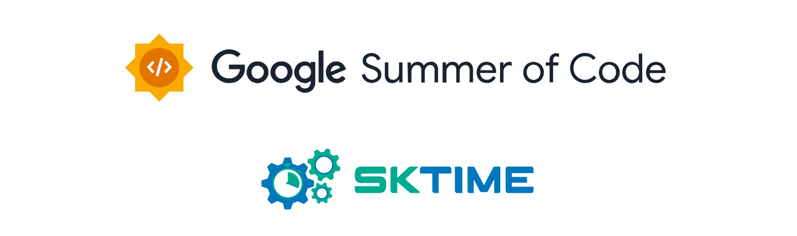

| **Attribute**     | **Details**                                               |
|:-------------------:|:-----------------------------------------------------------:|
| **Program**       | Google Summer of Code, 2024                               |
| **Organisation**  | Sktime: A unified framework for ML with time series        |
| **Project Title** | scaling, backends, foundation models - polars, pytorch, huggingface |
| **Mentors**       | fkiraly, benHeid                                           |
| **Difficulty**    | Hard                                                      |
| **Length**        | 350 hours                                                 |
