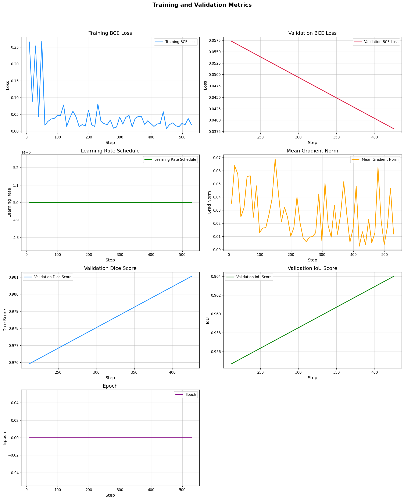
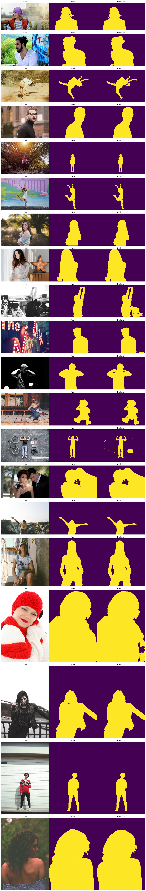
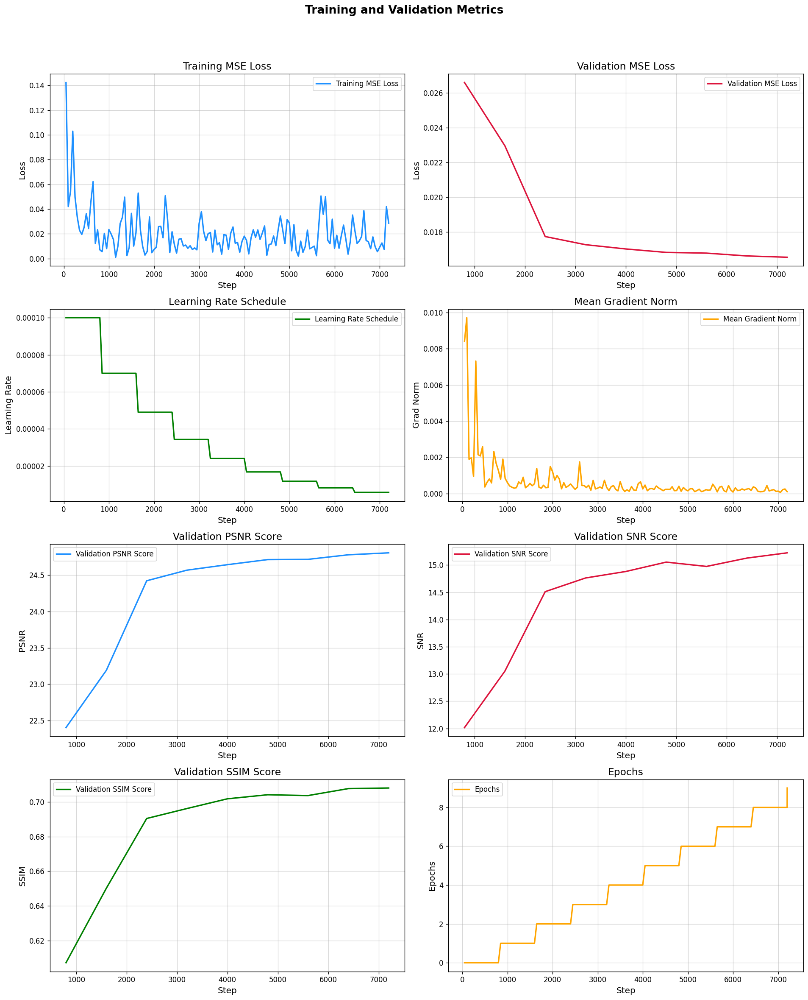
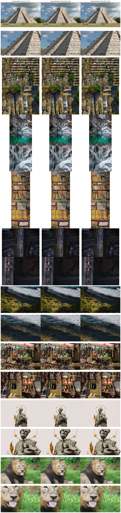
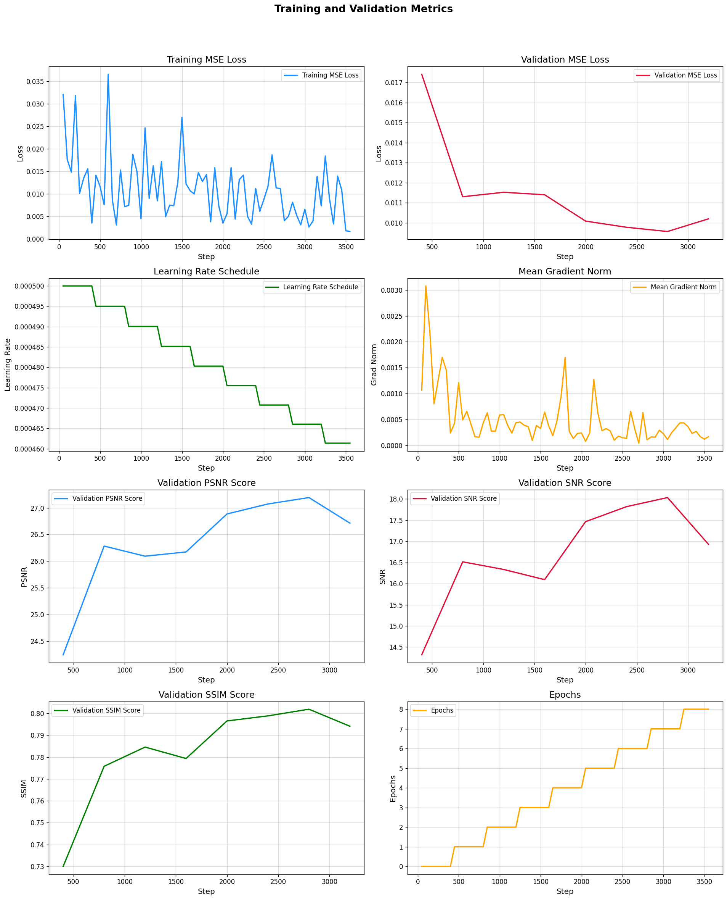

# DepthPro: Sharp Monocular Depth Estimation

**DepthPro** is a foundational model designed for zero-shot monocular depth estimation. Leveraging a multi-scale vision transformer (ViT-based, Dinov2), the model optimizes for dense predictions by processing images at multiple scales. Each image is split into patches, encoded using a shared patch encoder across scales, then merged, upsampled, and fused via a DPT decoder.

- **Research Paper**: [Depth Pro: Sharp Monocular Metric Depth in Less Than a Second](https://arxiv.org/pdf/2410.02073)
- **Authors**: [Aleksei Bochkovskii](https://arxiv.org/search/cs?searchtype=author&query=Bochkovskii,+A), [Amaël Delaunoy](https://arxiv.org/search/cs?searchtype=author&query=Delaunoy,+A), et al.
- **Official Code**: [apple/ml-depth-pro](https://github.com/apple/ml-depth-pro)
- **Official Weights**: [apple/DepthPro](https://huggingface.co/apple/DepthPro)
- **Unofficial Weights**: [geetu040/DepthPro](https://huggingface.co/geetu040/DepthPro)
- **Web UI Interface**: [spaces/geetu040/DepthPro](https://huggingface.co/spaces/geetu040/DepthPro)
- **Interface in Transformers (Open PR)**: https://github.com/huggingface/transformers/pull/34583

# DepthPro: Beyond Depth Estimation

In this repository, we use this architechture and the available pretrained weights for depth-estimation, to explore its capabilities in further image processings tasks like **Image Segmentation** and **Image Super Resolution**.

## Quick Links

| Task                           | Web UI Interface                                                                                  | Code-Based Inference and Weights                                                                    | Colab Notebook                                                                                                                                          | Kaggle Notebook                                                                                                                                | Training Logs                                                     | Validation Outputs                                                          |
| ------------------------------ | ------------------------------------------------------------------------------------------------- | --------------------------------------------------------------------------------------------------- | ------------------------------------------------------------------------------------------------------------------------------------------------------- | ---------------------------------------------------------------------------------------------------------------------------------------------- | ----------------------------------------------------------------- | --------------------------------------------------------------------------- |
| **Depth Estimation**           | [DepthPro](https://huggingface.co/spaces/geetu040/DepthPro)                                       | [geetu040 / DepthPro](https://huggingface.co/geetu040/DepthPro)                                       | -                                                                                                                                                       | -                                                                                                                                              | -                                                                 | -                                                                           |
| **Human Segmentation**         | [DepthPro Segmentation Human](https://huggingface.co/spaces/geetu040/DepthPro_Segmentation_Human) | [geetu040 / DepthPro Segmentation Human](https://huggingface.co/geetu040/DepthPro_Segmentation_Human) |  | -                                                                                                                                              | [Training Logs](assets/training_logs/Segmentation_Human.png)      | [Validation Outputs](assets/validation_outputs/Segmentation_Human.jpg)      |
| **Super Resolution (4x 256p)** | [DepthPro SR 4x 256p](https://huggingface.co/spaces/geetu040/DepthPro_SR_4x_256p)                 | [geetu040 / DepthPro SR 4x 256p](https://huggingface.co/geetu040/DepthPro_SR_4x_256p)                 |  |  | [Training Logs](assets/training_logs/SuperResolution_4x_256p.png) | [Validation Outputs](assets/validation_outputs/SuperResolution_4x_256p.png) |
| **Super Resolution (4x 384p)** | [DepthPro SR 4x 384p](https://huggingface.co/spaces/geetu040/DepthPro_SR_4x_384p)                 | [geetu040 / DepthPro SR 4x 384p](https://huggingface.co/geetu040/DepthPro_SR_4x_384p)                 |  |  | [Training Logs](assets/training_logs/SuperResolution_4x_384p.png) | [Validation Outputs](assets/validation_outputs/SuperResolution_4x_384p.png) |

## DepthPro: Image Segmentation (Human)

- For Web UI Interface: [**spaces/geetu040/DepthPro_Segmentation_Human**](https://huggingface.co/spaces/geetu040/DepthPro_Segmentation_Human)
- For Code-Based Inference and model weights: [**geetu040/DepthPro_Segmentation_Human**](https://huggingface.co/geetu040/DepthPro_Segmentation_Human)
- For Training, check the notebook on:
  - 
  - [Segmentation_Human.ipynb](Segmentation_Human.ipynb)

  
See the training logs

  

  
See the Validation Outputs

  

## DepthPro: Image Super Resolution (4x 256px)

- For Web UI Interface: [**spaces/geetu040/DepthPro_SR_4x_256p**](https://huggingface.co/spaces/geetu040/DepthPro_SR_4x_256p)
- For Code-Based Inference and model weights: [**geetu040/DepthPro_SR_4x_256p**](https://huggingface.co/geetu040/DepthPro_SR_4x_256p)
- For Training, check the notebook on:
  - 
  - 
  - [SuperResolution_4x_256p.ipynb](SuperResolution_4x_256p.ipynb)

  
See the training logs

  

  
See the Validation Outputs

  

## DepthPro: Image Super Resolution (4x 384px)

- For Web UI Interface: [**spaces/geetu040/DepthPro_SR_4x_384p**](https://huggingface.co/spaces/geetu040/DepthPro_SR_4x_384p)
- For Code-Based Inference and model weights: [**geetu040/DepthPro_SR_4x_384p**](https://huggingface.co/geetu040/DepthPro_SR_4x_384p)
- For Training, check the notebook on:
  - 
  - 
  - [SuperResolution_4x_384p.ipynb](SuperResolution_4x_384p.ipynb)

  
See the training logs

  

  
See the Validation Outputs

  

